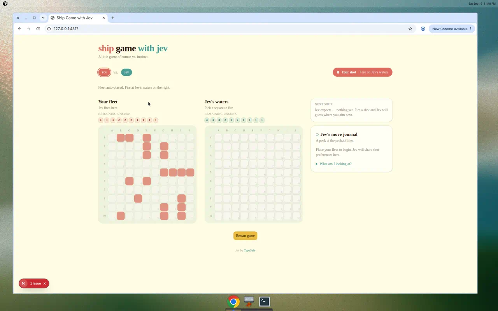
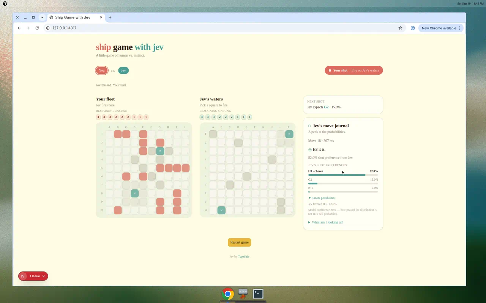

# Ship Game with Jev

Browser proof of concept for **Battleship vs Jev** — a warm, playful naval duel against Jev.

## Gameplay

A short playthrough (~34s): auto-place the fleet, fire on Jev’s waters, HIT and MISS, remaining unsunk ships, whose-turn badge, Jev thinking (border-beam, no orbs), and the “Jev expects …” line.

<video src="docs/demo.mp4" controls width="100%" preload="metadata">
  A 34-second gameplay recording is at <a href="docs/demo.mp4">docs/demo.mp4</a>.
</video>

The same recording lives at [`docs/demo.mp4`](docs/demo.mp4). After a clone, open that file or this page on GitHub.

## Stack

- [Next.js](https://nextjs.org/) (App Router) + TypeScript
- [Tailwind CSS](https://tailwindcss.com/) v4
- [shadcn/ui](https://ui.shadcn.com/)
- [Netlify](https://www.netlify.com/) (`@netlify/plugin-nextjs`)

## Prerequisites

- Node.js 20+
- npm 10+

## Local development

```bash
npm install
npm run dev
```

Open [http://localhost:4317](http://localhost:4317).

## Build

```bash
npm run build
npm run start
```

## Lint

```bash
npm run lint
```

## Deploy on Netlify

1. Connect this repository to Netlify.
2. Build settings are defined in `netlify.toml` (`npm run build` + `@netlify/plugin-nextjs`).
3. For the Jev AI proxy (later stages), set the environment variable:
   - `SHIP_GAME_TYPESAFE_API_KEY` — server-side only; never commit or expose in client code.

## Play

1. Place your fleet on the left board (or use **Auto-place fleet**).
2. Fire at Jev's waters on the right.
3. Hits let you fire again; misses hand off to Jev.
4. Sink all of Jev's ships to win — or lose if Jev sinks yours first.

Jev uses the `/api/jev/shot` proxy. Without `SHIP_GAME_TYPESAFE_API_KEY`, a local heuristic fallback still plays.

## Hunt-mode verification

Live hunt after heatmap-backed fire Choice. The journal reports **H3 · 82.0% from Jev** (not the heuristic fallback), and the shots sit on the checkerboard instead of walking A1→B1.





The same mid-game frame is also saved as [`docs/jev-hunt-journal-jev-source.png`](docs/jev-hunt-journal-jev-source.png).

## Project stages

1. **Scaffold** — Next.js + Tailwind + shadcn, Netlify-ready
2. **Game rules engine** — 10×10 board, fleet placement, no-touch rule
3. **UI** — fleet placement, dual boards, Jev move journal
4. **Jev backend proxy** — secure API integration
5. **Full playable match** — place → shoot ↔ Jev shot → win/lose

## License

Private project — see repository owner for terms.
