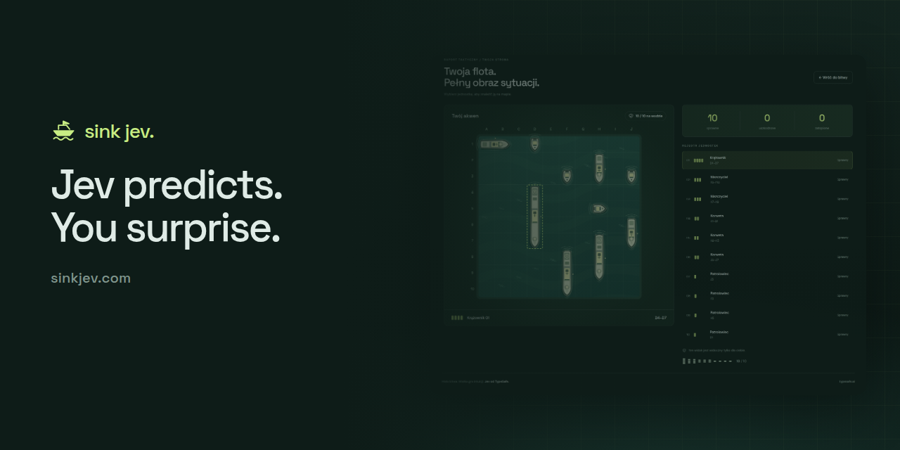
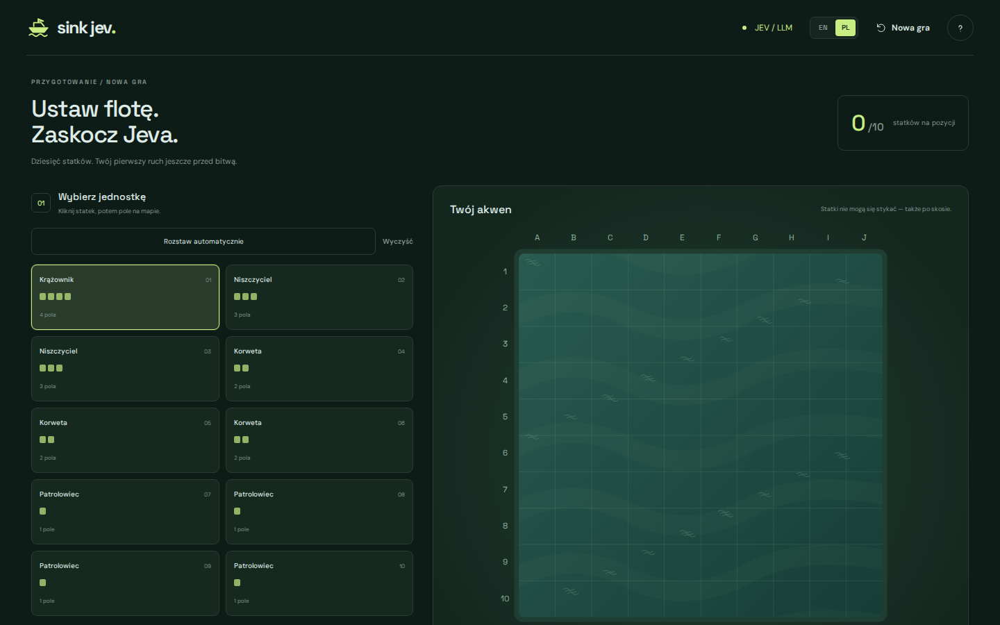
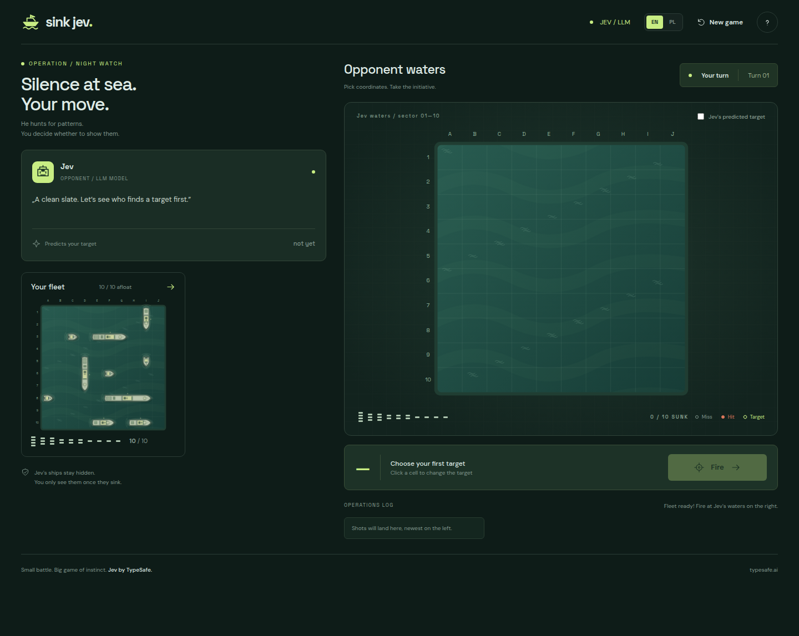
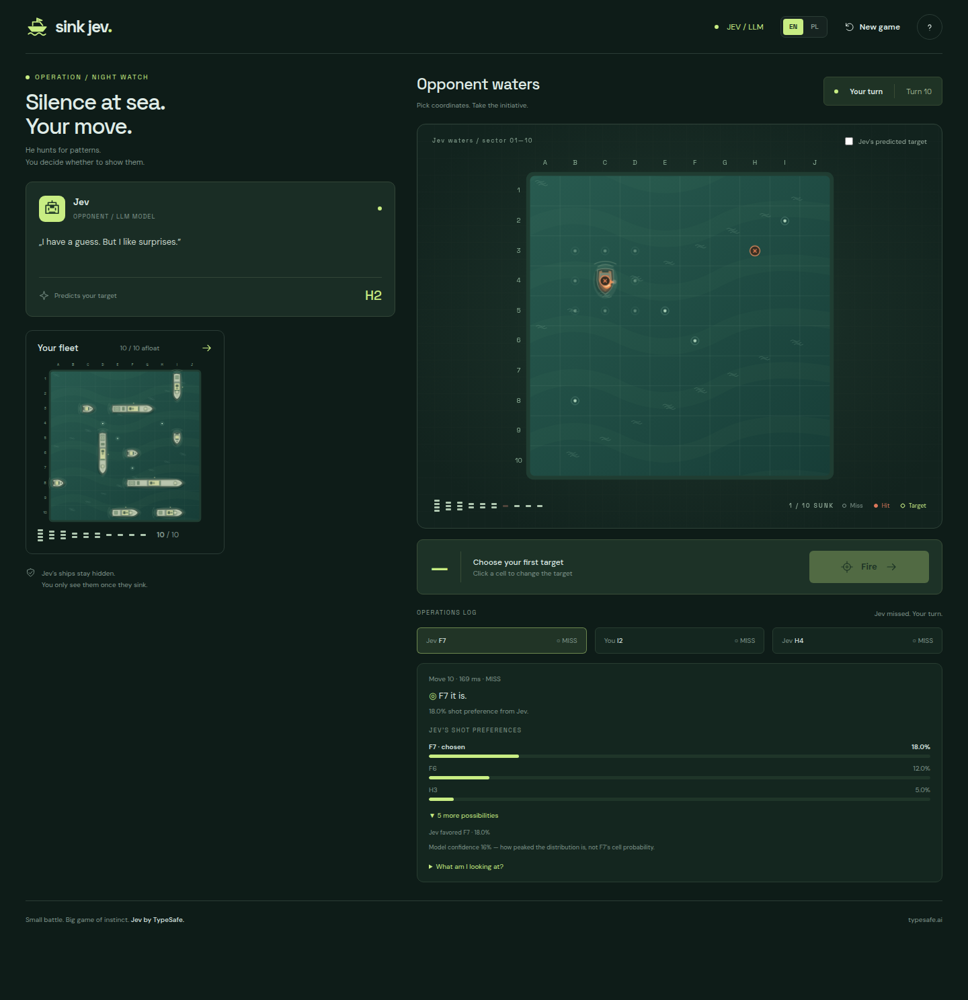
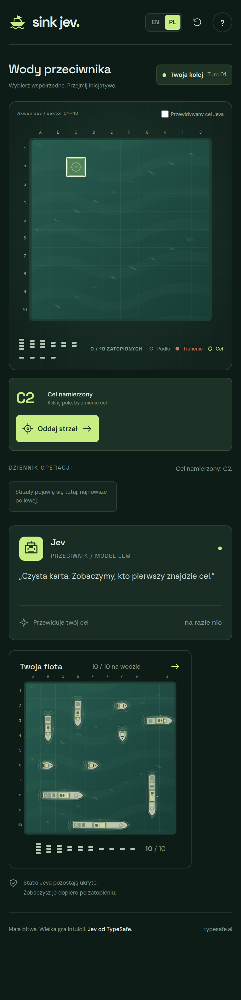
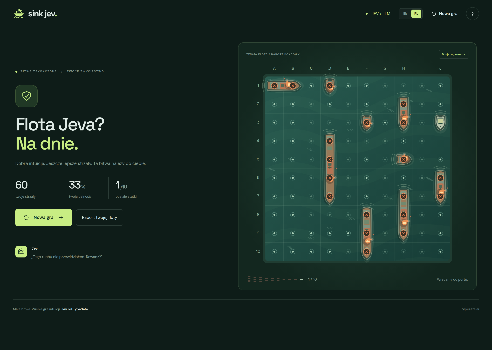
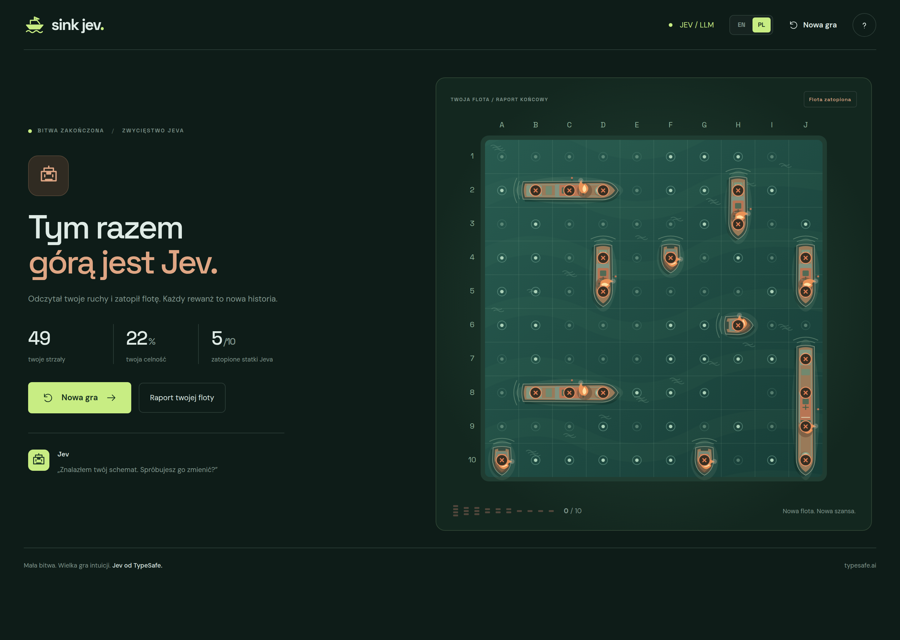

<p align="center">
  
</p>

# Ship Game with Jev

Play **Battleship vs TypeSafe Jev** at **[sinkjev.com](https://sinkjev.com)**.

The production look is **Nocna wachta**: dark sea greens, a lime accent, and a flat top-down 10 × 10 board. Ships and water are 2D. The play UI is English and Polish (`EN` / `PL` in the header). This README stays English.

Fleet lengths are `4, 3, 3, 2, 2, 2, 1, 1, 1, 1`. Ships cannot touch, including diagonally. After a sink, the eight-neighborhood is halo and leaves the legal-move set.

Jev hunts from a remaining-fleet occupancy **heatmap** (checkerboard hunt; once two hits share an axis he fires only at the line ends). He also predicts your next cell. That percentage is a **shot preference**, not a hit chance.

## Gameplay

A short playthrough (~17s): auto-deploy the fleet, lock a cell on Jev’s waters, **Fire**, then HIT / MISS, the operations log, whose-turn pill, and Jev’s next-shot prediction.

<video src="docs/demo.mp4" controls width="100%" preload="metadata">
  A gameplay recording is at <a href="docs/demo.mp4">docs/demo.mp4</a>.
</video>

The same file lives at [`docs/demo.mp4`](docs/demo.mp4). After a clone, open that file or this page on GitHub.

## Screenshots

### Deploy the fleet

Click a ship, then a cell (`R` rotates), or **Auto-deploy fleet**. Battle starts when all ten ships are placed.



### Battle

Your fleet sits on the left. Fire on Jev’s waters on the right. The Jev card shows his line and the cell he predicts you will aim at next. Toggle **Jev's predicted target** to paint his hunt/heatmap guess on the grid.



Jev’s operations log shows heatmap-backed shot preferences (not a fabricated hit chance) and whether the shot came **from Jev** or the local heuristic.



### Mobile

On a narrow viewport the opponent board and Fire control come first; your fleet and the operations log stack below.



### Outcome

Sink all of Jev’s ships to win. If he sinks yours first, the fleet report still shows the board.





## Stack

- [Next.js](https://nextjs.org/) (App Router) + TypeScript
- [Tailwind CSS](https://tailwindcss.com/) v4
- [shadcn/ui](https://ui.shadcn.com/)
- [Netlify](https://www.netlify.com/) (`@netlify/plugin-nextjs`)

## Prerequisites

- Node.js 20+
- npm 10+

## Local development

```bash
npm install
npm run dev
```

Open [http://localhost:4317](http://localhost:4317).

The language control stores the choice in `localStorage`. English is the default unless the browser language is Polish.

## Build

```bash
npm run build
npm run start
```

## Lint

```bash
npm run lint
```

## Deploy (mydevil s9)

Production: [sinkjev.com](https://sinkjev.com) and [api.sinkjev.com](https://api.sinkjev.com) on mydevil **s9** (FreeBSD, NGiNX + Passenger) — **not** Netlify.

**Build locally, ship artifacts only.** On your machine: `npm ci` and `npm run build`. Rsync the dist (`.next`, `public`, `app.js`, `package.json`, `package-lock.json`, sanitized `next.config.ts`) to both vhosts. On s9 run `npm ci --omit=dev` only when the lockfile changes — **never** `next build` on the server. Do not rsync Mac/Linux `node_modules` (native SWC binaries differ on FreeBSD).

```bash
chmod +x deploy-sinkjev.sh
./deploy-sinkjev.sh
```

Full runbook: [`docs/deploy.md`](docs/deploy.md).

Server-side secrets live in `~/.bash_profile` on s9 (never commit, never prefix with `NEXT_PUBLIC_`):

- `SHIP_GAME_TYPESAFE_API_KEY` — TypeSafe/Jev key for `/api/jev/shot`.
- `SHIP_GAME_SESSION_SECRET` — optional HMAC for play-session cookies (defaults from API key).
- `SHIP_GAME_JEV_DAILY_BUDGET`, `SHIP_GAME_JEV_IP_HOURLY`, `SHIP_GAME_JEV_SESSION_BUDGET` — cost guards.
- `SHIP_GAME_JEV_DISABLED=1` — kill switch; heuristic fallback only.
- `SHIP_GAME_LIVE_JEV_TESTS=1` — opt-in live Jev calls in tests.

**Config warning:** do not upload a `next.config.ts` that imports `lib/brand/materialize-pack-icons`, and do not rsync `next.config.compiled.js` from Mac. The deploy script strips that import and deletes compiled config on s9. Use `./deploy-sinkjev.sh --fix-config` if Passenger returns `ERR_MODULE_NOT_FOUND …materialize-pack-icons`.

`netlify.toml` and `netlify/functions/` remain for reference or alternate hosting; production uses Passenger `app.js` + the local-build flow above.

The shot proxy keeps the API key on the server, issues a short-lived HttpOnly session cookie (`GET /api/jev/session`), rejects cross-origin calls in production, and validates the board payload. Localhost / `127.0.0.1` are never blocked. The proxy does not 429 burst fire — a match’s HIT chain and fallback shots must stay playable.

## Play

1. Deploy your fleet on the setup screen (click to place, **R** to rotate, or **Auto-deploy fleet**). Start battle only when all ten ships are placed.
2. On Jev’s waters, click a cell to lock the target, then **Fire**. Hits let you fire again; misses hand off to Jev.
3. The left card shows Jev’s status and his predicted next cell. Toggle **Jev's predicted target** to see that guess on the grid. The percentage is a shot preference, not a hit chance.
4. Sink all of Jev's ships to win — or lose if Jev sinks yours first. **New game** returns to fleet setup.

Jev uses the `/api/jev/shot` proxy. The API key never leaves the server. Without a key, or when cost guards trip, a local heuristic fallback still plays. Hunt shots use the occupancy heatmap so Jev does not walk the grid A1→B1.

## Project stages

1. **Scaffold** — Next.js + Tailwind + shadcn
2. **Game rules engine** — 10×10 board, fleet placement, no-touch rule
3. **UI** — fleet placement, dual boards, Jev move journal
4. **Jev backend proxy** — secure API integration
5. **Full playable match** — place → shoot ↔ Jev shot → win/lose

## License

Private project — see repository owner for terms.
